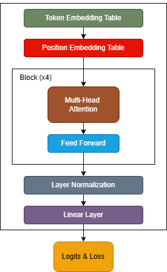
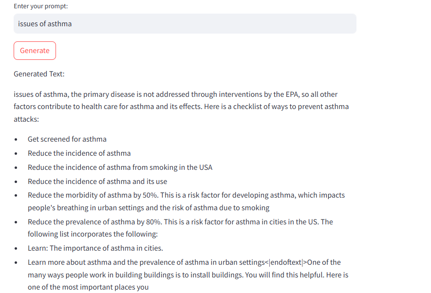

# LangPWT

This repository contains the implementation of a lightweight, modified version of the GPT architecture **LangPWT** trained from scratch using FineWeb-Edu, an open-source dataset. The project demonstrates the design, training, and optimization of a custom natural language model on local hardware.  

## Features  
- **Custom GPT Architecture**: A miniaturized version of the GPT model tailored for efficient training on limited hardware.  
- **Local Training**: Complete model training executed on local resources, enabling cost-effective development.  
- **Open-Source Datasets**: Trained using publicly available FineWeb-Edu dataset to ensure accessibility and reproducibility.  
- **Scalable Design**: Architecture optimized for experimentation and scalability while maintaining resource efficiency.  

<div align="center">
  
   <p><strong>Figure 1: Architecture of LangPWT</p>
</div>

## Implementation Details  
1. **Model Architecture**  
   - A streamlined GPT-based architecture designed for reduced complexity and improved training efficiency.  
   - Incorporates modifications to parameter scaling to suit resource-constrained environments.  

2. **Training**  
   - Training executed locally on NVIDIA GeForce RTX 3050 (Laptop) 4GB GPU, leveraging PyTorch.
    
3. **Testing**
   - A simple Streamlit UI created for testing generation capability of the model.

## Model Architecture

### Configuration  
- **Sequence Length:** 512 tokens  
- **Vocabulary Size:** 48,951 tokens  
  - Includes 50,000 BPE merges, 256 special byte tokens, and 1 `<|endoftext|>` token.  
- **Number of Layers:** 4 transformer blocks  
- **Attention Heads:** 8 per block  
- **Embedding Dimension:** 512  
- **Dropout:** 0.1  

### Components  
1. **Embeddings:**  
   - **Word Embeddings (`wte`):** Learnable token embeddings of size `n_embd`.  
   - **Position Embeddings (`wpe`):** Learnable positional embeddings for sequences up to `block_size`.  

2. **Transformer Blocks:**  
   - A stack of 4 transformer blocks, each comprising:  
     - Multi-head self-attention mechanisms.  
     - Feedforward networks for feature transformation.  

3. **Output Head:**  
   - **Linear Layer (`lm_head`):** Maps hidden states to logits for token predictions.  
   - Implements weight sharing between token embeddings (`wte`) and output projection for parameter efficiency.  

4. **Layer Normalization:**  
   - Final layer normalization (`ln_f`) ensures stable optimization.  


## Current Status:
1. Dataset Used: FineWeb-Edu (18.5 GB) entirely.
2. Training Steps: 5000
3. Time Taken: ~ 7 hours
4. File format: .pt

## Requirements  
- Python 3.8+  
- PyTorch 2.0+ or TensorFlow 2.10+  
- CUDA-enabled GPU with at least 4GB VRAM (recommended)  
- Dependencies listed in `requirements.txt`
- **Note**: Different OS support different versions of PyTorch/Tensorflow to use CUDA (local GPU). Install only after verifying for your OS. 

## Usage  
1. Clone the repository:  
  ```bash
  git clone https://github.com/pulkundwar29/LangPWT
  cd LangPWT
  ```
2. Create and activate a virtual environment:
  ```bash
  venv env
  env\scripts\activate
  ```
3. Install dependencies:
  ```bash
  pip install -r requirements.txt
  ```
4. Run the training file **trainpwt.py**
5. Run the streamlit file: **trial_pwt.py** 
6. Enter your prompt and hit the Generate button.

<div align="center">
  
   <p><strong>Figure 2: Example of Text Generated using LangPWT</p>
</div>
